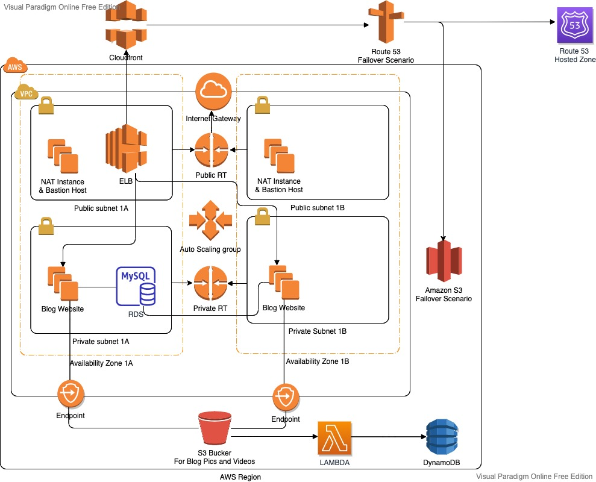

# Project-503 : Blog Page Application (Django) deployed on AWS Application Load Balancer with Auto Scaling, S3, Relational Database Service(RDS), VPC's Components, Lambda, DynamoDB and Cloudfront with Route 53

## Description

The Clarusway Blog Page Application aims to deploy blog application as a web application written Django Framework on AWS Cloud Infrastructure. This infrastructure has Application Load Balancer with Auto Scaling Group of Elastic Compute Cloud (EC2) Instances and Relational Database Service (RDS) on defined VPC. Also, The Cloudfront and Route 53 services are located in front of the architecture and manage the traffic in secure. User is able to upload pictures and videos on own blog page and these are kept on S3 Bucket. This architecture will be created by Firms DevOps Guy.

## Problem Statement

- Your company has recently ended up a project that aims to serve as Blog web application on isolated VPC environment. You and your colleagues have started to work on the project. Your Developer team has developed the application and you are going to deploy the app in production environment.

- Application is coded by Clarusway Fullstack development team and given you as DevOps team. App allows users to write their own blog page to whom user registration data should be kept in separate MySQL database in AWS RDS service and pictures or videos should be kept in S3 bucket. The object list of S3 Bucket containing movies and videos is recorded on DynamoDB table. 

## Resources

- [Python Django Framework](https://www.djangoproject.com/)

- [Python Django Example](https://realpython.com/get-started-with-django-1/)

- [AWS CLI Command Reference](https://docs.aws.amazon.com/cli/latest/index.html)
